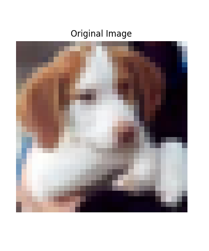
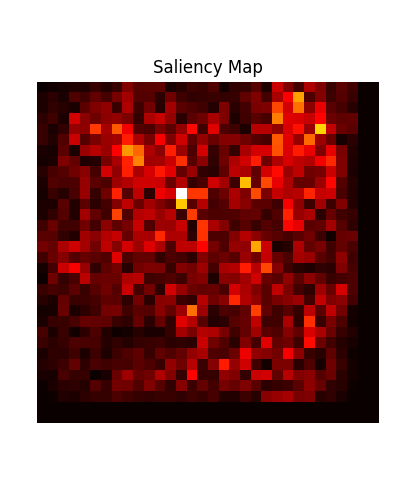
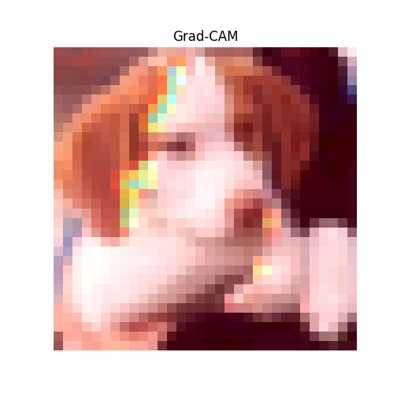

# Explainable CNN with Saliency Maps & Grad-CAM (CIFAR-10)

This project visualizes how a Convolutional Neural Network (CNN) interprets image classification using two popular explainable AI techniques:

- **Saliency Maps**: Highlight the most influential pixels for the model’s decision.
- **Grad-CAM**: Visualize class-specific regions learned by convolutional layers.

🧠 **Model**: Custom CNN trained on CIFAR-10  
📚 **Dataset**: CIFAR-10 (airplane, automobile, bird, cat, deer, dog, frog, horse, ship, truck)  
🛠️ **Tech stack**: Python, TensorFlow, NumPy, OpenCV, Matplotlib, Tkinter

---

## 🚀 Features

- Train a simple CNN on CIFAR-10 with accuracy/loss visualization.
- Apply Saliency Map and Grad-CAM for explainability.
- GUI (Tkinter) to select and analyze test images.
- Greek-language description popup per prediction.
- Navigation buttons and visualization controls.

---

## 🖥️ Example Output

*(Optional: Add image files in `/results/` and link them here)*

|               Original                   |                Saliency Map              |               Grad-CAM                 |
|------------------------------------------|------------------------------------------|----------------------------------------|
|  |  |  |

---

## 📦 Installation

Create a virtual environment and install dependencies:

```bash
pip install -r requirements.txt
```

## 📜 License

This project is licensed under the [MIT License](LICENSE).

